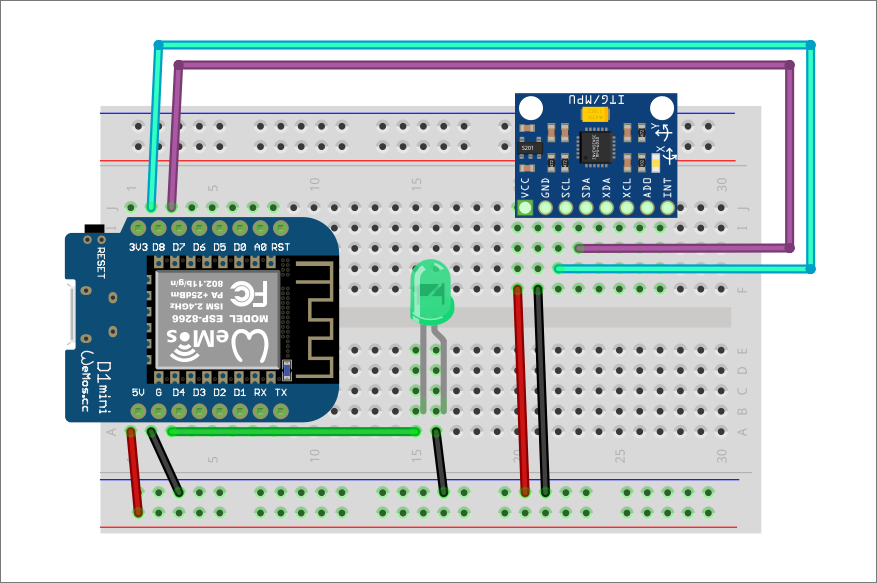
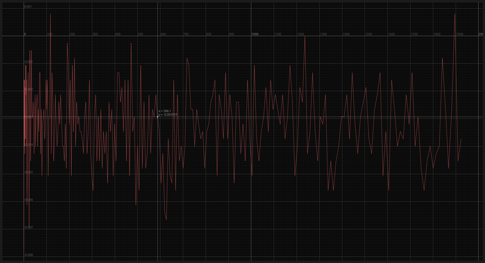
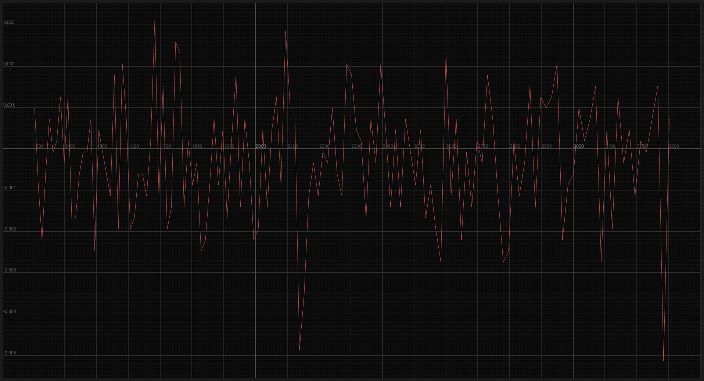
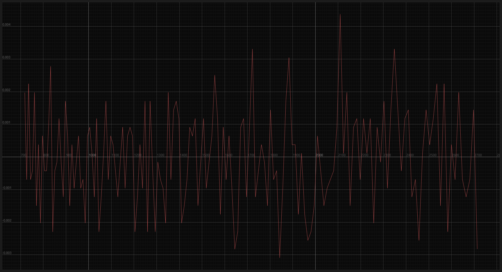
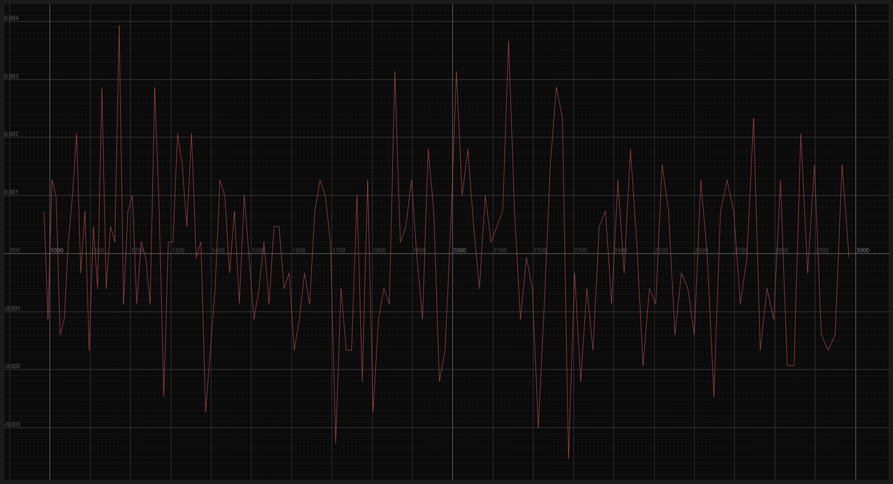

# Relazione - Parte Giroscopio

## Materiale utilizzato

- [MPU6050 data sheet](https://arduino.ua/docs/RM-MPU-6000A.pdf)
- [ESP32C3 Mini](https://www.wemos.cc/en/latest/c3/c3_mini.html)
- ESP32 38 pins (solo driver "custom")
- MPU6050
- Led 1x

### Driver MPU6050 "from scratch"

Inizialmente ho voluto scrivere un semplice driver per l'MPU6050 per misurare il tasso di rotazione durante il rollio, beccheggio e imbardata, in modo da comprendere bene il funzionamento del sensore attraverso la lettura del data-sheet e della sua implementazione.

#### Implementazione

Per creare un driver che sia -- potenzialmente -- completo e utilizzabile all'interno dell'ecosistema embedded in Rust, questo deve basarsi sulla libreria [embedded-hal](https://github.com/rust-embedded/embedded-hal). Il vantaggio di utilizzare tale astrazione hardware è che rende lo sviluppo della libreria indipendente dalla piattaforma.

##### I2C

La comunicazione _I2C_ è stata implementata tramite la combinazione dei _trait_ (un _trait_ può essere visto come un'_interfaccia_, rappresenta una capacità) `i2c::WriteRead` e `i2c::Write` dell'astrazione hardware.

```rust
#[derive(Debug)]
pub struct Mpu6050<I2C> {
    i2c: I2C,
    ...
}

impl<I2C, E> Mpu6050<I2C>
where
    I2C: i2c::WriteRead<Error = E> + i2c::Write<Error = E>,
{
    ...
}
```

Per semplificarne l'utilizzo ho realizzato i seguenti metodi:

```rust
fn write_byte(&mut self, register: u8, byte: u8) -> Result<(), E> {
    self.i2c.write(DEVICE_ADDR, &[register, byte])
}

fn read_2c_word(&mut self, register: u8) -> Result<i16, E> {
    let mut buffer = [0, 0];
    self.i2c.write_read(DEVICE_ADDR, &[register], &mut buffer)?;

    let high: u16 = buffer[0] as u16;
    let low: u16 = buffer[1] as u16;

    let word = (high << 8) | low;

    Ok(word as i16)
}
```

`write_byte` e `read_2c_word` sono due helper rispettivamente per la scrittura di un byte su un registro e per la lettura di una parola (2 byte) interpretata come complemento a due.

##### Gestione del driver

La procedura generale per la gestione del driver è piuttosto semplice:

1. identificare nel data sheet del sensore il suo indirizzo I2C di base;
2. identificare nella mappa dei registri la funzionalità di cui si è interessati;
3. una volta identificata la funzionalità desiderata basterà costruire il byte secondo le indicazioni della sezione ed inviarlo presso il registro a cui fa riferimento.

Consideriamo ad esempio l'istruzione per impostare il filtro passa basso e analizziamo le costanti definite:

```rust
/// Mpu6050 device address
const DEVICE_ADDR: u8 = 0x68;
/// Digital Low Pass Filter address
const DLPF_ADDR: u8 = 0x1A;
/// DLPF configuration of 10Hz bandwidth filter for Gyroscope
const DLPF_CFG_GYR_5: u8 = 0x05;

...
self.write_byte(DLPF_ADDR, DLPF_CFG_GYR_5)?;
...
```

- `DEVICE_ADDR`, all'interno del metodo helper `write_byte`, rappresenta l'indirizzo I2C dell'MPU6050;
- `DLPF_ADDR`, rappresenta l'indirizzo del registro 26, utilizzato per impostare il filto DLPF sia per il giroscopio che per l'accellerometro;
- `DLPF_CFG_GYR_5`, è il byte da scriver sul registro 26 ed è costruito seguendo le indicazioni della sezione sul data sheet:
  |Bit7|Bit6|Bit5 - Bit4 - Bit3|Bit2 - Bit1 - Bit0|
  |-|-|-|-|
  |-|-|`EXT_SYNC_SET[2:0]`|`DLPF_CFG[2:0]`|

  In questo caso `DLPF_CFG` è il parametro di interesse e viene impostato secondo la tabella appropriata. Per impostare il filtro a $10Hz$ il valore del parametro deve essere pari a `5`.
  Non essendo interessati a `EXT_SYNC_SET` e dato che i bit 6 e 7 non sono utilizzati, il valore del byte finale è `0x05`.
  |Bit7|Bit6|Bit5|Bit4|Bit3|Bit2|Bit1|Bit0|
  |-|-|-|-|-|-|-|-|
  |0|0|0|0|0|**1**|**0**|**1**|

##### Calibrazione

```rust
fn calibrate<D: DelayMs<u8>>(&mut self, delay: &mut D) -> Result<(), E> {
    for _ in 0..MAX_CALIBRATIONS {
        let (r, p, y) = self.raw_gyro()?;
        self.rate_cal_roll += r;
        self.rate_cal_pitch += p;
        self.rate_cal_yaw += y;
        delay.delay_ms(1);
    }

    self.rate_cal_roll /= MAX_CALIBRATIONS as f32;
    self.rate_cal_pitch /= MAX_CALIBRATIONS as f32;
    self.rate_cal_yaw /= MAX_CALIBRATIONS as f32;

    Ok(())
}
```

Per la calibrazione del giroscopio, si determina un valore di riferimento per il tasso di rotazione quando il sensore è **fermo**, che idealmente dovrebbe essere pari a zero. Poiché le misure del giroscopio tendono a fluttuare a causa di piccole vibrazioni ambientali, si calcola la media di un gran numero di valori. Il valore medio viene poi sottratto da tutte le future misurazioni per compensare le fluttuazioni e ottenere una misura più accurata.

```rust
pub fn gyro(&mut self) -> Result<(f32, f32, f32), E> {
    let (r, p, y) = self.raw_gyro()?;
    Ok((
        r - self.rate_cal_roll,
        p - self.rate_cal_pitch,
        y - self.rate_cal_yaw,
    ))
}
```

#### Conclusione

La scrittura del driver di un sensore è un'operazione complessa che permette di capire a 360 gradi il funzionamento del modulo e di realizzare librerie ad hoc per esigenze specifiche. Dato che questo progetto non richiede ne funzionalità particolari e neppure prestazioni particolarmente elevate, è sufficiente utilizzare librerie preesistenti come [_mpu6050_](https://crates.io/crates/mpu6050).

### Modulo gyro-controls

Questo primo approccio alla creazione del modulo consiste nell'utilizzare la libreria _mpu6050_ per mettere in comunicazione il sensore con la board tramite _I2C_, realizzare una calibrazione "naive" segnalata da un led e ottenere i tassi di rotazione di rollio, beccheggio e imbardata (da qui in avanti definiti come $r$, $p$, $y$).

#### Vista breadboard



> ATTENZIONE!
>
> La board in figura è una ESP8266 WeMos D1 mini, rispetto ad una ESP32C3 Mini la struttura è identica, cambiano le etichette dei pin, a seguire la mappatura:
> | WeMos D1 Mini | ESP32C3 Mini |
> |--------------- | --------------- |
> | D8 | 5 |
> | D7 | 4 |
> | D6 | 0 |
> | D5 | 1|
> | D0 | 2|
> | A0 | 3|
> | D4 | 6|
> | D3 | 7|
> | D2 | 8|
> | D1 | 10|

I collegamenti sono i seguenti:

- Alimentazione `5v`
- Led controllato da `6`
- I2C (ESP32C3 Mini non ha dei pin dedicati all'I2C, quindi è possibile scegliere qualsiasi GPIO)

  - `5` -> _SCL_
  - `4` -> _SDA_

#### Implementazione

> NB: Gli snippet di codice presente in questa sezione non presentano il controllo degli errori per semplicità

##### Setup del sensore

Inizialmente, si procede con la creazione dell'istanza dell'oggetto `Mpu6050`. A tal fine, si fornisce il driver _I2C_ come argomento a questa istanza. Subito dopo, occorre dare il via all'inizializzazione dell'oggetto e alla sua successiva configurazione. Questo procedimento implica:

- la disattivazione del sensore di temperatura, poiché non ritenuto necessario per l'obiettivo attuale;
- l'impostazione della sensibilità del giroscopio a ±500 °/s, al fine di adattarla alle specifiche esigenze dell'applicazione;

È opportuno sottolineare che la libreria utilizzata non consente all'utente di effettuare personalizzazioni relative al filtro passa-basso (DLPF), limitando quindi questa possibilità.

```rust
fn setup_mpu<D: DelayMs<u8>>(
    delay: &mut D,
    i2c: I2cDriver<'static>,
) -> Mpu6050<I2cDriver<'static>> {
    let mut mpu = Mpu6050::new(i2c);
    mpu.init(delay).unwrap();

    mpu.set_temp_enabled(false).unwrap();
    mpu.set_gyro_range(mpu6050::device::GyroRange::D500)
        .unwrap();

    mpu
}
```

##### Calibrazione



Nell'illustrazione soprastante è evidente come i dati acquisiti dal sensore in uno stato "fermo" manifestino un'oscillazione leggermente sotto lo zero, situandosi nell'intervallo compreso tra $0.001$ e $-0.008$.

Al fine di minimizzare il discostamento delle misurazioni effettuate dal sensore in stato di inattività rispetto allo zero, ho adottato lo stesso approccio di calibrazione utilizzato [precedentemente](#calibrazione): eseguire una misurazione, attendere per un millisecondo e successivamente calcolare la media delle letture raccolte nel corso di diverse iterazioni. Una volta completata la fase di calcolo, provvedo a spegnere il LED di controllo e a restituire i valori ottenuti dal processo di calibrazione.

###### Test di calibrazione

Nel corso dei test di calibrazione svolti, ho adottato un approccio che coinvolgeva tre set distinti di misurazioni: 500, 1000 e 2000. L'analisi delle rispettive letture in tutti e tre i test dimostra che queste presentano fluttuazioni tanto al di sopra quanto al di sotto dello zero. In contrasto, non ho osservato un incremento sostanziale nell'abbattimento dell'intervallo di errore, che rimane approssimativamente compreso tra $0.003$ e $-0.004$.

- 500 misurazioni:
  
- 1000 misurazioni:
  
- 2000 misurazioni:
  

Un'altra cosa da tenere presente è che il processo di calibrazione richiede un certo lasso di tempo, poiché ogni misurazione comporta un ritardo di $1ms$. Sebbene in teoria sarebbe necessario attendere $0.5s$ per il test con 500 misurazioni, $1s$ per quello con 1000 e $2s$ per quello con 2000, in pratica si verifica un rallentamento a causa delle operazioni matematiche coinvolte. Di conseguenza, il tempo effettivo si attesta a circa $1s$ per 500 misurazioni, circa $2s$ per 1000 e circa $4s$ per 2000. Dal momento che l'incremento delle misurazioni non conduce a un vantaggio considerevole, ho deciso di adottare il set di 500 misurazioni per la calibrazione.

```rust
fn calibrate_gyro<D: DelayMs<u16>>(
    delay: &mut D,
    mpu: &mut Mpu6050<I2cDriver>,
    info_led: &mut PinDriver<Gpio6, Output>,
) -> (f32, f32, f32) {
    let (mut cal_r, mut cal_p, mut cal_y) = (0., 0., 0.);
    const NUMBER_CAL: usize = 500;

    for _ in 0..NUMBER_CAL {
        cal_r += mpu.get_gyro().unwrap().x;
        cal_p += mpu.get_gyro().unwrap().y;
        cal_y += mpu.get_gyro().unwrap().z;
        delay.delay_ms(1);
    }

    info_led.set_low().unwrap();

    (
        cal_r / NUMBER_CAL as f32,
        cal_p / NUMBER_CAL as f32,
        cal_y / NUMBER_CAL as f32,
    )
}
```

##### Stima dell'angolo e conclusioni

Successivamente ho scritto una piccola demo per testare l'utilizzo del modulo appena scritto.

```rust
fn main() {
    esp_idf_sys::link_patches();
    esp_idf_svc::log::EspLogger::initialize_default();

    let peripherals = Peripherals::take().unwrap();

    let mut cal_led = PinDriver::output(peripherals.pins.gpio6).unwrap();
    cal_led.set_high().unwrap();

    let scl = peripherals.pins.gpio5;
    let sda = peripherals.pins.gpio4;

    let config = I2cConfig::new().baudrate(400000.Hz());
    let i2c = I2cDriver::new(peripherals.i2c0, sda, scl, &config).unwrap();

    let mut gyro_controls = GyroControls::init(i2c, &mut cal_led);

    let mut last_roll_rate = 0.;
    let mut roll_angle = 0.;

    const DELTA_TIME: f32 = 0.004;

    loop {
        let (roll_rate, _, _) = gyro_controls.get_gyro();
        roll_angle += 0.5 * (roll_rate + last_roll_rate) * DELTA_TIME;
        last_roll_rate = roll_rate;

        println!("{}", roll_angle.to_degrees(),);

        Delay::delay_ms(4);
    }
}
```

Il codice soprastante stima l'angolo di rollio ($r$) approssimando l'integrale definito in tempo discreto:

$$
r \approx \frac{\Delta t}{2} [f(t_0)+2f(t_1)+ \dots+2f(t_{n-1})+f(t_n)]
$$

- La frequenza di aggiornamento è di $250Hz$, quindi il $\Delta t$ tra due misurazioni è pari a $0.004s$;
- Per semplificare il calcolo si usa lo scalare $0.5$ come $\frac{\Delta t}{2}$;

- Dato che le misurazioni del giroscopio sono in $rad/s$ è necessario convertirle in gradi: `roll_angle.to_degrees()`.

Dopo aver condotto vari test e effettuato movimenti della breadboard lungo l'asse $x$, è chiaro che questa soluzione non è adatta per una stima a lungo termine, in quanto ho potuto osservare un notevole accumulo di errore nel tempo. Tale accumulo è osservabile anche quando la breadboard rimane immobile, seppur in misura minore. L'errore riscontrato è attribuibile al fatto che i sensori giroscopici misurano principalmente la velocità angolare, ovvero il tasso di variazione dell'angolo, e non l'orientamento assoluto. 

In considerazione di queste limitazioni, ho valutato l'utilizzo dell'**accelerometro** come alternativa per calcolare l'orientamento assoluto.

### Modulo gyro-controls: stima tramite accelerometro

L'**accelerometro** è un sensore in grado di misurare l'accelerazione lineare di un oggetto e può essere utilizzato per calcolare l'orientamento assoluto di un oggetto lungo due assi: $x$ e $y$ (per farlo lungo l'asse $z$ è necessario un **magnetometro**).

L'implementazione è semplice e diretta dato che la libreria _mpu6050_ offre di base il metodo per calcolare la stima di rollio e beccheggio; le uniche operazioni aggiuntive da fare sono il settaggio della sensibilità dell'accelerometro e la conversione da $rad/s$ a gradi.

```rust
fn setup_mpu<D: DelayMs<u8>>(
    delay: &mut D,
    i2c: I2cDriver<'static>,
) -> Mpu6050<I2cDriver<'static>> {
    ...
    mpu.set_accel_range(mpu6050::device::AccelRange::G8)
    .unwrap();

    mpu
}
```

```rust
pub fn get_orientation(&mut self) -> (f32, f32) {
    let angles = self.mpu.get_acc_angles().unwrap();

    (angles.x.to_degrees(), angles.y.to_degrees())
}
```
