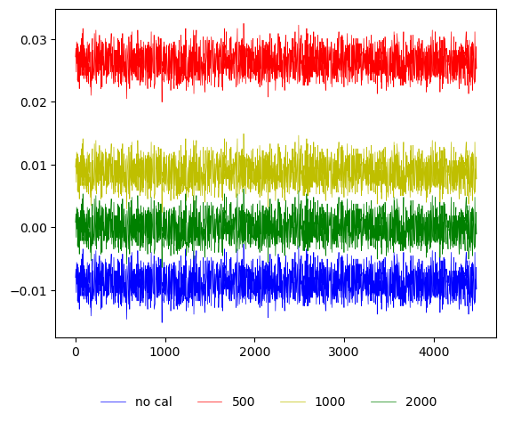
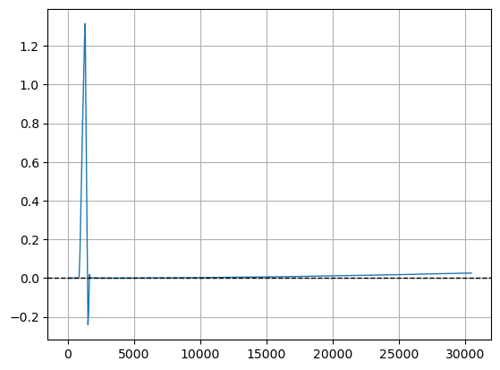
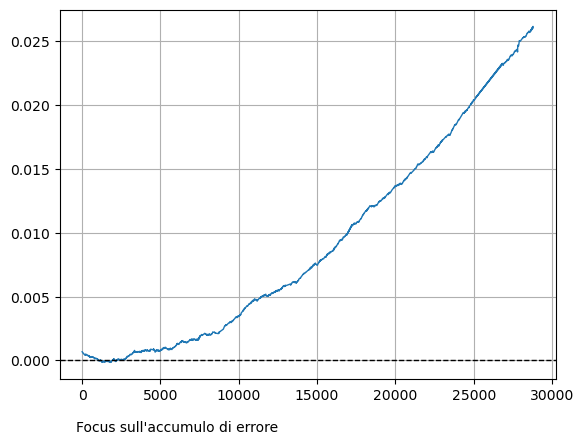
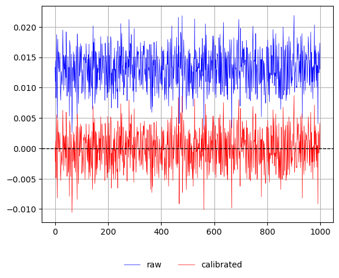
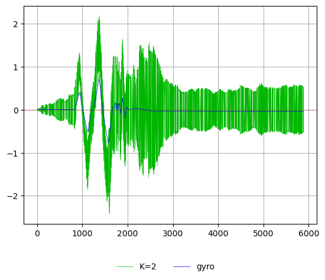
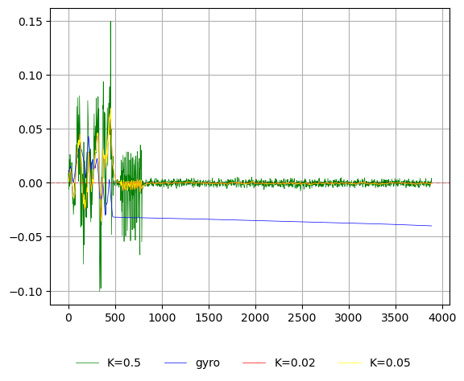
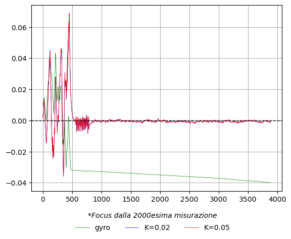

# Relazione

## Modulo 'servo'

Nel seguente capitolo verranno illustrate le scelte implementative per la realizzazione del modulo che implementa un semplice driver per il motore servo SG90.

Il motore servo SG90[^1] è un motore standard leggero e di piccole dimensioni. Il servo motore può ruotare di circa 180 gradi (90 gradi per ogni direzione) e utilizza segnali di modulazione di larghezza di impulso (PWM) per determinare la posizione dell'albero. Un impulso di $1.5ms$ posiziona l'albero al centro, un impulso di $1ms$ lo posiziona all'estrema sinistra (-90 gradi), mentre un impulso di $2ms$ lo posiziona all'estrema destra (90 gradi).

### Generare una PWM con l'ESP32-C3

Per generare il segnale di larghezza di impulso con l'ESP32-C3 è stata utilizzata la periferica LEDC[^2] (_LED control_). Questa periferica è progettata principalmente per controllare l'intensità dei LED, ma può anche essere configurata per altri scopi, come ad esempio la generazione di una PWM.

Il modulo LEDC consente di generare fino a 6 segnali PWM indipendenti utilizzando 4 timer, con una risoluzione massima di 14 bit[^3]. A differenza del modello superiore ESP32, l'ESP32-C3 supporta solamente l'output a bassa velocità (_low speed channel_), che viene gestito tramite software[^4].

La creazione delle strutture dati necessarie per l'impostazione di un canale LEDC richiede due informazioni importanti: la frequenza della PWM e la risoluzione. La prima è facilmente determinabile, poiché il servo SG90 funziona con un periodo di $20ms$, da cui si ottiene che la frequenza è $\frac{1}{20ms}=50Hz$.

La scelta dei bit di risoluzione richiede una considerazione aggiuntiva, dato che la frequenza del timer e i bit della risoluzione sono interdipendenti e legati alla frequenza del clock, che nel caso dell'ESP32-C3 è di $80MHz$. Più alta è la frequenza della PWM, più bassa è la risoluzione (e viceversa). Dato che non è possibile generare un'onda più veloce di quella consentita dal clock, si dovrebbe puntare a mantenere $f_{PWM}*2^{DUTY\_RES} < 80MHz$[^5]. La frequenza utilizzata è $50Hz$, quindi è possibile utilizzare al massimo 14 bit di risoluzione. Il minimo è stato determinato tramite un processo di _trial and error_, grazie ai messaggi di errore dell'API, ed è pari a 9 bit. Il valore finale scelto è 11 bit, poiché un valore maggiore di 11 non garantiva una precisione aggiuntiva nella conversione.

```rust
...
let timer_config = TimerConfig {
    frequency: Hertz(50),
    resolution: Resolution::Bits11,
};
let timer_driver = LedcTimerDriver::new(timer, &timer_config).unwrap();
let driver = LedcDriver::new(channel, timer_driver, gpio).unwrap();
...
```

### Scrittura e lettura dell'angolo

Nonostante la documentazione del motore servo SG90 indichi che il range di azione varia tra $1ms$ e $2ms$, le osservazioni pratiche hanno dimostrato che il range effettivo può estendersi da $500\mu s$ a $2500\mu s$. Utilizzando l'intervallo $1ms-2ms$, l'albero del servo motore non riesce a raggiungere gli angoli estremi di $-90°$ e $90°$, suggerendo che le specifiche teoriche non riflettano completamente il comportamento reale del dispositivo o che i servo utilizzati nel progetto non rispettino completamente le specifiche standard.

Il primo passo è mappare l'angolo desiderato in gradi al corrispondente valore in
microsecondi. La formula utilizzata per questa mappatura lineare è:

$$
\alpha_{\mu s} = \frac{2500-500}{90-(-90)}(\alpha-(-90)) + 500
= \frac{2000}{180}(\alpha+90) + 500
$$

dove:

- $500\mu s \le \alpha_{\mu s} \le 2500\mu s$ e rappresenta il valore dell'angolo in
  microsecondi;
- $-90° \le \alpha \le 90°$ e rappresenta il valore dell'angolo in gradi.

Il passo successivo prevede la conversione del valore in microsecondi in un duty cycle digitale. Questo valore deve essere calcolato considerando che il periodo del segnale di controllo è di $20ms$ e che la risoluzione è di 11 bit. La formula utilizzata per il duty cycle è:

$$
duty = \frac{2^{11}-1}{pwm\_period}\alpha_{us}
$$

Tramite queste due equazioni, è possibile scrivere la funzione che, dato un angolo compreso tra $-90°$ e $90°$, muova l'albero del servo motore approssimativamente nella posizione corrispondente.

```rust
pub fn write_angle(&mut self, angle: i16) -> Result<()> {
    let angle_us =
        (MAX_MINUS_MIN_DUTY / MAX_MINUS_MIN_ANGLE * (angle as f32 - MIN_ANGLE)) + MIN_DUTY_US;

    let duty = (self.max_duty as f32 * angle_us / FREQ) as u32;
    self.driver.set_duty(duty).unwrap();

    Ok(())
}
```

Per implementare la funzione che "legge" l'angolo, è necessario derivare le funzioni inverse delle mappature precedenti. Questo processo consente di riconvertire il valore digitale del duty cycle e del segnale in microsecondi nell'angolo corrispondente in gradi. Le formule inverse sono:

- $$
  \alpha_{us} = \frac{duty * f_{period}}{2^{11} - 1}
  $$

- $$
  \alpha = (\alpha_{\mu s} - 500)\frac{90-(-90)}{2500-500}+(-90) =
  (\alpha_{\mu s} - 500)\frac{180}{2000} - 90
  $$

```rust
pub fn read_exp_angle(&mut self) -> i16 {
    let duty = self.driver.get_duty();
    let angle_us = (duty as f32 * FREQ) / self.max_duty as f32;

    ((angle_us - MIN_DUTY_US) * (MAX_MINUS_MIN_ANGLE / MAX_MINUS_MIN_DUTY) + MIN_ANGLE) as i16
}
```

È importante sottolineare che il valore letto dell'angolo non è effettivamente frutto della lettura di un sensore, ma una conversione del valore che assume il duty cycle nel momento della lettura.

Durante il processo di conversione, è stato osservato un errore medio di $0.5°$. Questo errore è stato determinato attraverso un test[^6].

## Modulo per la gestione dell'orientamento

Nel seguente capitolo verranno illustrate le scelte implementative per la realizzazione del modulo che gestisce l'orientamento del dispositivo utilizzando il sensore MPU6050.

Il sensore MPU6050 è un modulo integrato che combina un accelerometro a tre assi e un giroscopio a tre assi, offrendo una soluzione completa per il rilevamento dell'accelerazione, della velocità, dell'orientamento, dello spostamento e altri parametri relativi al movimento di un sistema o di un oggetto.

### Calibrazione del giroscopio

Il sensore MPU6050 in condizioni ideali, dovrebbe restituire valori prossimi allo zero per il giroscopio quando il sensore è fermo; tuttavia, dall'osservazione dei dati grezzi è emerso uno scostamento significativo dai valori attesi, indicando la presenza di uno scostamento, o bias, nel sensore.

Per correggere questo scostamento, è stata implementata una strategia di calaibrazione "naive", che sebbene semplice, è efficace per eliminare il bias rilevato. La tecnica si articola nei seguenti passaggi:

1. Acquisizione di $n$ campioni: vengono effettuate una serie di misurazioni statiche, acquisendo $n$ campioni consecutivi dei dati grezzi provenienti dal giroscopio. Durante questa fase, il sensore è mantenuto in una posizione stabile e senza movimento.
2. Calcolo della media: i campioni acquisiti vengono utilizzati per calcolare la media dei valori per ciascun asse del giroscopio. Questo passaggio permette di stimare il valore medio del bias presente nel sensore.
3. Sottrazione del bias: una volta calcolato il bias per ciascun asse, questo viene sottratto dai dati misurati durante il normale funzionamento del sensore.

#### Scelta dei parametri di calibrazione del giroscopio

Per determinare il numero ottimale di campioni $n$ da utilizzare nella calibrazione, sono stati considerati tre valori distinti, scelti arbitrariamente: 500, 1000 e 2000.

Dopo aver applicato la calibrazione per ciascuno dei valori di $n$[^7], i risultati sono stati raccolti, analizzati e confrontati[^8]. L'analisi grafica ha evidenziato come l'aumento del numero di campioni $n$ porti a una riduzione progressiva del bias residuo. In particolare è stato osservato che utilizzando 2000 campioni, i valori medi del bias risultano essere i più vicini allo zero, indicando una calibrazione più accurata e stabile rispetto alle altre due configurazioni.



#### Considerazioni sull'intervallo di tempo tra le misurazioni

Introdurre un intervallo di tempo tra le misurazioni durante la calibrazione del sensore potrebbe teoricamente migliorare le qualità dei dati raccolti. Per valutare l'efficacia di questa strategia è stato condotto un test pratico per determinare l'intervallo minimo di tempo necessario tra le misurazioni. I risultati hanno indicato che l'intervallo minimo di tempo necessario è di $1ms$. Tuttavia è emerso che, per come è implementato il codice internamente, anche un breve ritardo come questo può portare a un significativo aumento del tempo totale di calibrazione, rendendo l'intero processo troppo lungo e quindi impraticabile. (Per 500 misurazioni il tempo teorico di attesa dovrebbe essere di $0.5s$, il tempo osservato era di circa $5s$).

Sebbene l'introduzione di un intervallo di tempo tra le misurazioni possa teoricamente migliorare la qualità dei dati di calibrazione, il test pratico ha dimostrato che il tempo di attesa non è compatibile con le esigenze di tempo e precisione del sistema.

### Stima dell'angolo attraverso il giroscopio

È possibile ottenere una stima dell'angolo ($\theta_{r,y,p}$) integrando il tasso di rotazione ($\omega_{r,y,p}$) fornito dal giroscopio lungo l'asse di interesse:

$$
\theta_{r,y,p}(t) = \int_0^t \omega_{r,y,p}(t)dt
$$

Il giroscopio misura la velocità angolare, quindi l'angolo può essere calcolato integrando questa velocità nel tempo. Nella pratica, l'integrazione continua del segnale del giroscopio (`roll_rate`) è stata eseguita in modo discreto, secondo la formula:

$$
\theta_{t+1} =\theta_t + \omega_t \cdot \Delta t
$$

Per verificare il comportamento del sistema, è stata eseguita una demo in cui la scheda veniva mossa lungo l'asse di rollio (asse X) e successivamente mantenuta ferma. Nel contesto della demo il tasso di rotazione (`roll_rate`) è misurato in radianti al secondo, mentre il passo temporale $\Delta t$ è stato impostato a $0.004s$. Questo valore deriva dal delay di $4ms$ presente nel loop di campionamento della demo, poiché la frequenza di aggiornamento scelta per il sistema è di $250Hz$.

```rust
const UPDATE_TIME_MS: u8 = 4;
const DELTA_TIME: f32 = UPDATE_TIME_MS as f32 / 1000.;

fn main() -> Result<()> {
    // Set up

    let mut roll_angle: f32 = 0.;

    loop {
        let roll_rate = controller.get_roll()?;
        roll_angle += roll_rate * DELTA_TIME;

        println!("{}", roll_angle);

        FreeRtos::delay_ms(UPDATE_TIME_MS.into());
    }
}
```

I dati raccolti mostrano chiaramente che, nonostante l'angolo stimato segua inizialmente il movimento reale, con il passare del tempo si verifica un accumulo di errore. Questo fenomeno è dovuto al fatto che ciascuna misura del tasso di rotazione presenta un certo margine di errore, il quale viene sommato all'angolo stimato a ogni iterazione durante il processo di integrazione. Di conseguenza, si genera un errore cumulativo che aumenta progressivamente con il passare del tempo.




In considerazione di queste limitazioni, è stato valutato l'utilizzo dell'accelerometro come alternativa per stimare l'orientamento assoluto, offrendo una potenziale soluzione per ridurre l'accumulo di errore nel tempo della integrazione del giroscopio.

### Stima dell'angolo attraverso l'accelerometro

L'accelerometro è un sensore in grado di misurare l'accelerazione lineare di un oggetto. Questa informazione può essere sfruttata per stimare l'orientamento assoluto lungo due assi, rollio (asse X) e beccheggio (asse Y), misurando la componente della gravità lungo tali assi. Per determinare l'orientamento lungo l'asse di imbardata (asse Z) sarebbe invece necessario un magnetometro, poiché l'accelerometro da solo non è sufficiente.

L'implementazione della stima dell'orientamento tramite accelerometro è semplice e immediata grazie all'uso della libreria _mpu6050_, che fornisce un metodo predefinito per calcolare rollio e beccheggio (`get_acc_angles`).

Analogamente a quanto fatto per il [giroscopio](#calibrazione-del-giroscopio), l'accelerometro è stato calibrato utilizzando una serie di 2000 misurazioni. Come mostrato nel grafico, le misurazioni calibrate risultano più accurate, con valori che si avvicinano molto di più allo zero rispetto a quelli ottenuti senza calibrazione[^9].



A differenza del giroscopio, l'accelerometro non soffre del problema dell'accumulo di errore nel tempo, poiché non richiede l'integrazione per calcolare l'orientamento. Tuttavia, presenta un'altra limitazione significativa: è estremamente sensibile ai disturbi esterni, come vibrazioni e movimenti improvvisi.

### Stima dell'angolo con il filtro complementare

I metodi di stima dell'angolo analizzati fino ad ora, basati sull'uso del giroscopio e dell'accelerometro, hanno ciascuno punti di forza e debolezze. L'obiettivo è combinare entrambe le misurazioni attraverso un algoritmo di fusione per bilanciare i vantaggi dei due sensori e correggere i rispettivi svantaggi.

Il metodo più semplice e diretto per fondere i dati di giroscopio e accelerometro è il **filtro complementare**. Questo filtro sfrutta il principio secondo cui i due sensori forniscono informazioni complementari: il giroscopio è affidabile a breve termine, mentre l'accelerometro a lungo termine. Il funzionamento del filtro è basato sulla combinazione ponderata delle due misurazioni, dove si utilizza il giroscopio per stimare l'angolo e l'accelerometro per correggerne la deriva.

L'implementazione del filtro complementare si basa sulla seguente formula:

$$
\theta_{t+1} = K \cdot \alpha_t + (1-K) \cdot (\theta_t + \omega_t \cdot \Delta t)
$$

Dove:

- $\theta_t$ è l'angolo stimato al tempo $t$;
- $\alpha_t$ è l'angolo stimato attraverso l'accelerometro ;
- $\omega_t$ è il tasso di rotazione rilevato dal giroscopio al tempo $t$;
- $0 \le K \le 1$ è il coefficiente che determina il peso da assegnare alle due misure;
- $\Delta t$ è il passo temporale (impostato anche in questo caso a $4ms$).

La scelta del valore di $K$ è cruciale: un valore troppo elevato rischia di sovra pesare il contributo dell'accelerometro, amplificando i disturbi, mentre un valore troppo basso rallenta la correzione della deriva del giroscopio.

Per determinare il valore più adatto, è stato condotto un esperimento[^10] testando i seguenti valori di $K$: $5, 2, 0.5, 0.05, 0.02$. È stato osservato che con $K=5$, il sistema genera valori di `+/-inf`, indicando dei overflow. Con $K=2$, la misurazione è risultata estremamente disturbata e instabile come si può osservare dal grafico sottostante.



I risultati migliori si sono ottenuti con valori di $K$ inferiori a 1, in particolare con $K=0.05$ e $K=0.02$, dove l'angolo stimato risultava più stabile e l'effetto dei disturbi ridotto al minimo. Come si osserva dal secondo grafico sottostante, la differenza tra i risultati ottenuti con $K=0.05$ e $K=0.02$ sembrerebbe minima. Pertanto, si è deciso di adottare un valore intermedio, ossia la media tra i due coefficienti, $K=0.035$, ritenendo che questo bilanci in modo ottimale la correzione fornita dall'accelerometro e la stabilità delle misurazioni.




Un algoritmo che offre una stima molto più precisa rispetto al filtro complementare è il **filtro di Kalman**. Tuttavia, a causa della sua complessità di implementazione e considerando il target del progetto, si è deciso di utilizzare il filtro complementare, che rappresenta una soluzione più semplice e adeguata per le esigenze attuali.

## Riferimenti

[^1]: [Servo motor SG90](http://www.ee.ic.ac.uk/pcheung/teaching/DE1_EE/stores/sg90_datasheet.pdf)
[^2]: Espressif docs, [LED Control (LEDC)](https://docs.espressif.com/projects/esp-idf/en/v5.2.2/esp32c3/api-reference/peripherals/ledc.html)
[^3]: [LEDC features](https://www.espressif.com/sites/default/files/documentation/esp32-c3_technical_reference_manual_en.pdf#ledpwm)
[^4]: [LEDC High and Low Speed Mode](https://docs.espressif.com/projects/esp-idf/en/stable/esp32/api-reference/peripherals/ledc.html#ledc-high-and-low-speed-mode)
[^5]: [ESP32 Basics: Generating a PWM Signal on the ESP32](https://lastminuteengineers.com/esp32-pwm-tutorial/)
[^6]: Test demo reperibile al tag `servo_error_test`
[^7]: Demo calibrazione reperibile al tag `calibration`
[^8]: Analisi in `data/Analysis.ipynb`
[^9]: Demo calibrazione e stima dell'accelerometro al tag `accel_estimation`
[^10]: Demo filtro complementare al tag `compl_filter`
