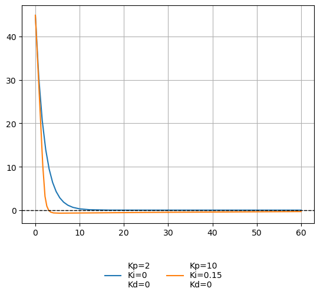

# PoC - Stabilizzazione automatica del beccheggio

[toc]

## Introduzione

L'obiettivo del progetto è lo sviluppo di un sistema di stabilizzazione automatica per un aeroplano di carta, utilizzando una piattaforma embedded per il controllo in tempo reale. Il progetto pone particolare enfasi sull'hardware, con la scelta e l'integrazione di sensori e attuatori per il bilanciamento del velivolo, affrontando le sfide pratiche dell'interfacciamento con il mondo fisico.

Attraverso il progetto, si intendono sviluppare le competenze fondamentali nella progettazione di sistemi embedded come: la scelta della piattaforma hardware, sensori e attuatori più adatti al proprio scopo; la progettazione e l'implementazione di algoritmi di controllo e la scelta di protocolli di comunicazione per l'interfacciamento dei dispositivi.

## Descrizione

Il progetto consiste nello sviluppo di un sistema in grado di rilevare l'assetto di un aereo di carta, in particolare l'angolo di beccheggio, e di regolare di conseguenza l'inclinazione della superficie di controllo (elevatore), compensando eventuali deviazioni rispetto alla posizione desiderata.

Il sistema è basato su un ESP32-C3 che gestisce i dati provenienti da un sensore IMU MPU6050 per rilevare l'ordientamento del velivolo e controlla il servomotore responsabile della regolazione della superficie di volo. Il software implementato sul SoC è progettato per interpretare i dati del sensore e applicare le correzioni necessarie per mantenere l'aereo in equilibrio.

### Componentistica e librerie

**Componenti elettronici**:
- ESP32-C3
- IMU MPU6050
- SG90
- Breadboard da 830 contatti
- Led verde e rosso
- Cavi e jumper

**Software**:

- Linguaggio di programmazione: Rust
- Ecosistema [esp-rs](https://github.com/esp-rs) per Rust
- Libreria [mpu6050](https://crates.io/crates/mpu6050)

**Componenti per il modello**:

- Cartoncino
- Nastro adesivo
- Colla
- Filo di metallo
- Spiedi di bambù

#### Architettura del sistema

TODO: schema e circuito

#### Funzionamento del sistema

Il funzionamento del sistema può essere diviso in due parti principali: _stima dell'assetto_ e _stabilizzazione automatica del beccheggio attraverso il controllo PID_. 

Nella fase di stima, inizialmente il sistema calibra l'MPU6050, per garantire misurazioni più accurate.  Successivamente, l'orientamento viene stimato a partire dai dati acquisiti dal sensore. La fase di stabilizzazione automatica viene gestita attraverso un feedback loop chiuso, che elabora i dati dell'assetto e determina il segnale di correzione da inviare al servomotore. Il sistema è progettato per funzionare con una frequenza di aggiornamento di $4ms$ ($250Hz$), garantendo una risposta rapida e sufficiente per lo scopo del progetto.

Il flusso operativo del sistema può essere schematizzato come segue:

````mermaid
flowchart LR 
	a(Calibrazione MPU6050) --> b(Acquisizione dati)
	b --> c(Stima dell'angolo)
	c --> d(Elaborazione e controllo PID)
	d --> e(Attuazione della correzione)
	e --> b
````

### Modello fisico

Il corpo dell'aereo è costituito da una parte principale in cartoncino, sulla quale sono montati il giroscopio e il servomotore, e da una sezione più piccola che funge da elevatore. Per consentire il movimento dell'elevatore, questo è stato fissato con del nastro adesivo, lasciando un piccolo spazio rispetto alla struttura principale per garantire libertà di rotazione.

Il servomotore è collegato all'elevatore tramite un filo metallico, che funge da asta di comando. L'asta è agganciata al braccio del servo da un lato e dall'altro a una piccola superficie verticale fissata sull'elevatore. Questo collegamento consente al servo di trasmettere il movimento al piano mobile. 

L'intera struttura è montata su un telaio a forma di H, realizzato con bastoncini di bambù, che consente alla piattaforma superiore di ruotare liberamente attorno all'asse di beccheggio, simulando il movimento di un aeroplano in volo. La base di supporto del telaio è anch'essa realizzata in cartoncino.

Inizialmente, il corpo dell'aereo aveva una forma rettangolare, lunga e stretta. Successivamente, nel tentativo di migliorare l'aerodinamicità, è stato leggermente accorciato e allargato. Questa modifica ha inoltre permesso di ottimizzare la lunghezza dell'asta di comando, garantendo una trasmissione del movimento più accurata.


## Sviluppo e implementazione

> NB: _negli snippet di codice non è presente il controllo degli errori_

### Modulo per la gestione del servomotore SG90

Per controllare l'elevatore dell'aereo, è stato impiegato il servomotore SG90[^1], un motore standard leggero e di piccole dimensioni. Il servomotore può ruotare di circa 180 gradi (90 gradi per ogni direzione) e utilizza segnali di _modulazione di larghezza di impulso_ (PWM) per determinare la posizione dell'albero. 

In particolare, la posizione neutra dell'elevatore corrisponde a un angolo di 0 gradi. Quando l'albero è ruotato a +90 gradi, l'elevatore si inclina verso l'alto di un angolo simile, mentre a -90 gradi si inclina verso il basso. L'angolo effettivo dell'elevatore non corrisponde esattamente a quello del servomotore, a causa di imprecisioni nella geometria del modello e nel collegamento tra l'albero del servo e l'albero dell'elevatore.

Nei seguenti capitoli verranno descritte le scelte implementative adottate per il controllo del servo SG90, in particolare le modalità di generazione del segnale PWM e sulla determinazione della posizione dell'albero.

#### Generare una PWM con l'ESP32-C3

Per generare il segnale PWM con l'ESP32-C3 è stata utilizzata la periferica LEDC[^2] (_LED control_). Questa periferica è progettata principalmente per controllare l'intensità dei LED, ma può anche essere configurata per la generazione di segnali PWM.

Il modulo LEDC consente di generare fino a 6 segnali PWM indipendenti utilizzando 4 timer, con una risoluzione massima di 14 bit[^3]. A differenza del modello superiore ESP32, l'ESP32-C3 supporta solamente l'output a bassa velocità (_low speed channel_), che viene gestito tramite software[^4].

La creazione delle strutture dati necessarie per l'impostazione di un canale LEDC richiede due informazioni importanti: la frequenza della PWM e la risoluzione. La prima è facilmente determinabile, poiché il servo SG90 funziona con un periodo di $20ms$, da cui si ottiene che la frequenza è $\frac{1}{20ms}=50Hz$. Per quanto riguarda la risoluzione, il valore massimo supportato è di 14 bit, mentre il minimo, determinato tramite un processo di _trial and error_ sfruttando i messaggi di errore dell'API, è risultato pari a 9 bit. Il valore finale scelto è stato di 11 bit, poiché un valore maggiore di questa soglia non garantiva una precisione aggiuntiva nella conversione.

```rust
...
let timer_config = TimerConfig {
    frequency: Hertz(50),
    resolution: Resolution::Bits11,
};
let timer_driver = LedcTimerDriver::new(timer, &timer_config).unwrap();
let driver = LedcDriver::new(channel, timer_driver, gpio).unwrap();
...
```

#### Scrittura e lettura dell'angolo

Nonostante la documentazione del motore servo SG90 indichi che il range di azione varia tra $1ms$ e $2ms$, le osservazioni pratiche hanno dimostrato che il range effettivo può estendersi da $500\mu s$ a $2500\mu s$. Utilizzando l'intervallo $1ms-2ms$, l'albero del servo motore non riesce a raggiungere gli angoli estremi di $-90°$ e $90°$, suggerendo che le specifiche teoriche non riflettano completamente il comportamento reale del dispositivo o che i servo utilizzati nel progetto non rispettino completamente le specifiche standard.

Il primo passo è mappare l'angolo desiderato in gradi al corrispondente valore in microsecondi. La formula utilizzata per questa mappatura lineare è:

$$
\alpha_{\mu s} = \frac{2500-500}{90-(-90)}(\alpha-(-90)) + 500 
= \frac{2000}{180}(\alpha+90) + 500
$$

dove:

- $500\mu s \le \alpha_{\mu s} \le 2500\mu s$ e rappresenta il valore dell'angolo in
  microsecondi;
- $-90° \le \alpha \le 90°$ e rappresenta il valore dell'angolo in gradi.

Il passo successivo prevede la conversione del valore in microsecondi in un duty cycle digitale. Questo valore deve essere calcolato considerando che il periodo del segnale di controllo è di $20ms$ e che la risoluzione è di 11 bit. La formula utilizzata per il duty cycle è:

$$
duty = \frac{2^{11}-1}{pwm\_period}\alpha_{us}
$$

Tramite queste due equazioni, è possibile scrivere la funzione che, dato un angolo compreso tra $-90°$ e $90°$, muova l'albero del servo motore approssimativamente nella posizione corrispondente.

```rust
pub fn write_angle(&mut self, angle: i16) -> Result<()> {
    let angle_us =
        (MAX_MINUS_MIN_DUTY / MAX_MINUS_MIN_ANGLE * (angle as f32 - MIN_ANGLE)) + MIN_DUTY_US;

    let duty = (self.max_duty as f32 * angle_us / FREQ) as u32;
    self.driver.set_duty(duty).unwrap();

    Ok(())
}
```

Per implementare la funzione che "legge" l'angolo, è necessario derivare le funzioni inverse delle mappature precedenti. Questo processo consente di riconvertire il valore digitale del duty cycle e del segnale in microsecondi nell'angolo corrispondente in gradi. Le formule inverse sono:

- $$
  \alpha_{us} = \frac{duty * f_{\mathrm{period}}}{2^{11} - 1}
  $$

- $$
  \alpha = (\alpha_{\mu s} - 500)\frac{90-(-90)}{2500-500}+(-90) =
  (\alpha_{\mu s} - 500)\frac{180}{2000} - 90
  $$

```rust
pub fn read_exp_angle(&mut self) -> i16 {
    let duty = self.driver.get_duty();
    let angle_us = (duty as f32 * FREQ) / self.max_duty as f32;

    ((angle_us - MIN_DUTY_US) * (MAX_MINUS_MIN_ANGLE / MAX_MINUS_MIN_DUTY) + MIN_ANGLE) as i16
}
```

È importante sottolineare che il valore letto dell'angolo non è effettivamente frutto della lettura di un sensore, ma una conversione del valore che assume il duty cycle nel momento della lettura.

Durante il processo di conversione, è stato osservato un errore medio di $0.5°$. Questo errore è stato determinato attraverso un test[^5].

### Modulo per la stima dell'assetto

Per stimare l'assetto dell'aereo, in particolare l'angolo di beccheggio, è stato usato il sensore MPU6050, un modulo integrato che combina un accelerometro a tre assi e un giroscopio a tre assi. Il sensore è gestito tramite la libreria [`mpu6050`](https://crates.io/crates/mpu6050), che semplifica l'acquisizione e l'elaborazione dei dati provenienti dai suoi sensori.

> _Durante lo sviluppo del modulo, il sensore MPU6050 era posizionato in modo differente rispetto alla configurazione finale. Di conseguenza, l'angolo inizialmente considerato era quello di rollio anziché quello di beccheggio. Tuttavia, dal punto di vista dell'implementazione, ciò non comporta differenze sostanziali, in quanto il principio di funzionamento rimane invariato._

#### Comunicazione con il sensore

L'MPU6050 comunica con il controllore tramite il protocollo I2C. Per garantire un buon compromesso tra velocità di trasmissione e affidabilità, è stata scelta una frequenza di $200kHz$, che si colloca tra la modalità _standard_ (fino a $100kHz$) e la modalità _fast_ (fino a $400kHz$). Questa scelta consente di ottenere prestazioni adeguate senza incorrere in problemi di stabilità nella comunicazione.

L'ESP32-C3 non dispone di pin dedicati per il bus I2C, tuttavia, i pin possono essere assegnati via software. Sono stati scelti i seguenti GPIO:

- GPIO 4 per la linea SDA (dati)
- GPIO 5 per la linea SCL (clock)

Per configurare correttamente la comunicazione I2C, è necessario creare due strutture: `I2cConfig`, che contiene la configurazione del bus, e `I2cDriver`, l'oggetto che viene effettivamente utilizzato per la comunicazione.

```rust
...
let scl = peripherals.pins.gpio5;
let sda = peripherals.pins.gpio4;

let i2c_config = I2cConfig::default().baudrate(Hertz(200000));
let i2c_driver = I2cDriver::new(peripherals.i2c0, sda, scl, &i2c_config).unwrap();
...
```

#### Setup del MPU6050

Il sensore MPU6050 viene inizializzato e configurato con la seguente funzione: 

```rust
fn setup_mpu<D: DelayNs>(delay: &mut D, i2c: I2cDriver<'a>) -> Result<MpuDriver<'a>> {
    let mut mpu = Mpu6050::new(i2c);

    mpu.init(delay).unwrap();

    mpu.set_temp_enabled(false).unwrap();
    mpu.set_gyro_range(GyroRange::D500).unwrap();
    mpu.set_accel_range(AccelRange::G8).unwrap();

    Ok(mpu)
}
```

Si inizia creando un'istanza dell'oggetto `Mpu6050`, passando come argomento il driver I2C. Successivamente, il sensore viene inizializzato e configurato per adattarsi alle esigenze del sistema. La configurazione prevede i seguenti passaggi:

- Disattivazione del sensore di temperatura, in quanto non necessario per la stabilizzazione del sistema.
- Impostazione della sensibilità del giroscopio a ±500°/s, scelta che garantisce un buon compromesso tra precisione e capacità di rilevare rotazioni rapide senza saturazione.
- Impostazione della sensibilità dell’accelerometro a ±8g, valore che permette di catturare sia piccole variazioni di assetto sia accelerazioni più intense senza compromettere la qualità delle misurazioni.

Questa configurazione consente di bilanciare sensibilità e robustezza nei confronti di eventuali disturbi o vibrazioni. 

#### Calibrazione del giroscopio

Il sensore MPU6050 in condizioni ideali, dovrebbe restituire valori prossimi allo zero per il giroscopio quando il sensore è fermo; tuttavia, dall'osservazione dei dati grezzi è emerso uno scostamento significativo dai valori attesi, indicando la presenza di uno scostamento, o bias, nel sensore.

Per correggere questo bias, è stata implementata una strategia di calibrazione "naive", che sebbene semplice, è efficace per eliminare il bias rilevato. La tecnica si articola nei seguenti passaggi:

1. Acquisizione di $n$ campioni: vengono effettuate una serie di misurazioni statiche, acquisendo $n$ campioni consecutivi dei dati grezzi provenienti dal giroscopio. Durante questa fase, il sensore è mantenuto in una posizione stabile e senza movimento.
2. Calcolo della media: i campioni acquisiti vengono utilizzati per calcolare la media dei valori per ciascun asse del giroscopio. Questo passaggio permette di stimare il valore medio del bias presente nel sensore.
3. Sottrazione del bias: una volta calcolato il bias per ciascun asse, questo viene sottratto dai dati misurati durante il normale funzionamento del sensore.

##### Scelta dei parametri di calibrazione del giroscopio

Per determinare il numero ottimale di campioni $n$ da utilizzare nella calibrazione, sono stati considerati tre valori distinti, scelti arbitrariamente: 500, 1000 e 2000.

Dopo aver applicato la calibrazione per ciascuno dei valori di $n$[^6], i risultati sono stati raccolti, analizzati e confrontati[^7]. L'analisi grafica ha evidenziato come l'aumento del numero di campioni $n$ porti a una riduzione progressiva del bias residuo. In particolare è stato osservato che utilizzando 2000 campioni, i valori medi del bias risultano essere i più vicini allo zero, indicando una calibrazione più accurata e stabile rispetto alle altre due configurazioni.


##### Considerazioni sull'intervallo di tempo tra le misurazioni

Introdurre un intervallo di tempo tra le misurazioni durante la calibrazione del sensore potrebbe teoricamente migliorare le qualità dei dati raccolti. Per valutare l'efficacia di questa strategia è stato condotto un test pratico con un intervallo di $1ms$ (il tempo minimo consentito). Tuttavia è emerso che, per come è implementato il codice internamente, anche un breve ritardo come questo può portare a un significativo aumento del tempo totale di calibrazione, rendendo l'intero processo troppo lungo e quindi impraticabile. (Per 500 misurazioni il tempo teorico di attesa dovrebbe essere di $0.5s$, il tempo osservato era di circa $5s$).

Sebbene l'introduzione di un intervallo di tempo tra le misurazioni possa teoricamente migliorare la qualità dei dati di calibrazione, il test pratico ha dimostrato che il tempo di attesa non è compatibile con le esigenze di tempo e precisione del progetto.

#### Stima dell'angolo attraverso il giroscopio

È possibile ottenere una stima dell'angolo ($\theta$) integrando il tasso di rotazione ($\omega$) fornito dal giroscopio lungo l'asse di interesse, nel caso specifico il beccheggio (pitch):

$$
\theta(t) = \int_0^t \omega(t)dt
$$
Il giroscopio misura la velocità angolare, quindi l'angolo può essere calcolato integrando questa velocità nel tempo. Nella pratica, l'integrazione continua del segnale del giroscopio è stata eseguita in modo discreto, secondo la formula:

$$
\theta_{t+1} =\theta_t + \omega_t \cdot \Delta t
$$

Per verificare il comportamento del sistema, è stata eseguita una demo in cui la scheda veniva mossa lungo l'asse di rollio (asse X) e successivamente mantenuta ferma. Nel contesto della demo il tasso di rotazione è misurato in radianti al secondo, mentre il passo temporale $\Delta t$ è stato impostato a $0.004s$. (Questo valore deriva dal delay di $4ms$ presente nel loop di campionamento della demo, poiché la frequenza di aggiornamento scelta per il sistema è di $250Hz$).

```rust
const UPDATE_TIME_MS: u8 = 4;
const DELTA_TIME: f32 = UPDATE_TIME_MS as f32 / 1000.;

fn main() -> Result<()> {
    // Set up

    let mut roll_angle: f32 = 0.;

    loop {
        let roll_rate = controller.get_roll()?;
        roll_angle += roll_rate * DELTA_TIME;

        println!("{}", roll_angle);

        FreeRtos::delay_ms(UPDATE_TIME_MS.into());
    }
}
```

I dati raccolti mostrano chiaramente che, nonostante l'angolo stimato segua inizialmente il movimento reale, con il passare del tempo si verifica un accumulo di errore. Questo fenomeno è dovuto al fatto che ciascuna misura del tasso di rotazione presenta un certo margine di errore, il quale viene sommato all'angolo stimato a ogni iterazione durante il processo di integrazione. Di conseguenza, si genera un errore cumulativo che aumenta progressivamente con il passare del tempo.


In considerazione di queste limitazioni, è stato valutato l'utilizzo dell'accelerometro come alternativa per stimare l'orientamento assoluto.

#### Stima dell'angolo attraverso l'accelerometro

L'accelerometro è un sensore in grado di misurare l'accelerazione lineare di un oggetto. Questa informazione può essere sfruttata per stimare l'orientamento assoluto lungo due assi, rollio (asse X) e beccheggio (asse Y), misurando la componente della gravità lungo tali assi. (Per determinare l'orientamento lungo l'asse di imbardata (asse Z) sarebbe invece necessario un magnetometro, poiché l'accelerometro da solo non è sufficiente).

L'implementazione della stima dell'orientamento tramite accelerometro è semplice e immediata grazie all'uso della libreria _mpu6050_, che fornisce un metodo predefinito per calcolare rollio e beccheggio (`get_acc_angles`).

Analogamente a quanto fatto per il [giroscopio](#calibrazione-del-giroscopio), l'accelerometro è stato calibrato utilizzando una serie di 2000 misurazioni. Come mostrato nel grafico, le misurazioni calibrate risultano più accurate, con valori che si avvicinano molto di più allo zero rispetto a quelli ottenuti senza calibrazione[^8].


A differenza del giroscopio, l'accelerometro non soffre del problema dell'accumulo di errore nel tempo, poiché non richiede l'integrazione per calcolare l'orientamento. Tuttavia, presenta un'altra limitazione significativa: è estremamente sensibile ai disturbi esterni, come vibrazioni e movimenti improvvisi.

#### Stima dell'angolo con il filtro complementare

I metodi di stima dell'angolo analizzati fino ad ora, basati sull'uso del giroscopio e dell'accelerometro, hanno ciascuno punti di forza e debolezze. L'obiettivo è combinare entrambe le misurazioni attraverso un algoritmo di fusione per bilanciare i vantaggi dei due sensori e correggere i rispettivi svantaggi.

Il metodo più semplice e diretto per fondere i dati di giroscopio e accelerometro è il **filtro complementare**. Questo filtro sfrutta il principio secondo cui i due sensori forniscono informazioni complementari: il giroscopio è affidabile a breve termine, mentre l'accelerometro a lungo termine. Il funzionamento del filtro è basato sulla combinazione ponderata delle due misurazioni, dove si utilizza il giroscopio per stimare l'angolo e l'accelerometro per correggerne la deriva.

L'implementazione del filtro complementare si basa sulla seguente formula:

$$
\theta_{t+1} = K \cdot \alpha_t + (1-K) \cdot (\theta_t + \omega_t \cdot \Delta t)
$$

Dove:

- $\theta_t$ è l'angolo stimato al tempo $t$;
- $\alpha_t$ è l'angolo stimato attraverso l'accelerometro ;
- $\omega_t$ è il tasso di rotazione rilevato dal giroscopio al tempo $t$;
- $0 \le K \le 1$ è il coefficiente che determina il peso da assegnare alle due misure;
- $\Delta t$ è il passo temporale (impostato anche in questo caso a $4ms$).

La scelta del valore di $K$ è cruciale: un valore troppo elevato rischia di sovra pesare il contributo dell'accelerometro, amplificando i disturbi, mentre un valore troppo basso rallenta la correzione della deriva del giroscopio.

Per determinare il valore più adatto, è stato condotto un esperimento[^9] testando i seguenti valori di $K$: $5, 2, 0.5, 0.05, 0.02$. È stato osservato che con $K=5$, il sistema genera valori di `+/-inf`, indicando dei overflow. Con $K=2$, la misurazione è risultata estremamente disturbata e instabile come si può osservare dal grafico sottostante.


I risultati migliori si sono ottenuti con valori di $K$ inferiori a 1, in particolare con $K=0.05$ e $K=0.02$, dove l'angolo stimato risultava più stabile e l'effetto dei disturbi ridotto al minimo. Come si osserva dal secondo grafico sottostante, la differenza tra i risultati ottenuti con $K=0.05$ e $K=0.02$ sembrerebbe minima. Pertanto, si è deciso di adottare un valore intermedio, ossia la media tra i due coefficienti, $K=0.035$, ritenendo che questo bilanci in modo ottimale la correzione fornita dall'accelerometro e la stabilità delle misurazioni.


Un algoritmo che offre una stima molto più precisa rispetto al filtro complementare è il **filtro di Kalman**. Tuttavia, a causa della sua complessità di implementazione e considerando il target del progetto, si è deciso di utilizzare il filtro complementare, che rappresenta una soluzione più semplice e adeguata per le esigenze attuali.

### Stabilizzazione del beccheggio

Per implementare la stabilizzazione automatica è stato adottato un feedback loop chiuso, in cui lo stato del sistema è determinato dall'angolo di beccheggio. Questo viene regolato attraverso la superficie di controllo apposita, l'elevatore, azionato dal servomotore. Il controllore scelto per gestire il sistema è un PID, per la sua semplicità di implementazione e flessibilità.

#### Simulazione del PID

Dato che inizialmente non era ancora stato sviluppato un modello fisico, è stata realizzata una simulazione[^10] semplificata per la configurazione del PID. Il moto di rotazione è stato modellato con la seguente equazione differenziale:
$$
\frac{dx}{dt} = -a x + bu
$$
dove:

- $x$ rappresenta l'errore (angolo di beccheggio rispetto al setpoint), l'angolo che determina la posizione dell'elevatore;
- $a$ è un coefficiente di smorzamento, che rappresenta forze dissipative come attrito e resistenza aerodinamica (assunto molto basso a causa della configurazione fisica del sistema);
- $u$ è l'output del controllo PID;
- $b$ è un parametro che indica l'influenza dell'output sul sistema (anche in questo caso, ipotizzato basso).

Il codice che implementa la simulazione è il seguente:

```python
...

# sim params
dt = 0.004
T = 60
steps = int(T/dt)

# sys params
a = .1 #damping factor
b = .2 #control effectiveness 

def clamp(n, min_val, max_val):
    return max(min_val, min(n, max_val))

def simulate(Kp, Ki, Kd, sp, initial):
    n = len(Kp)
    angle = np.full(n, initial) # initial
    i = np.full(n, 0.)
    prev_err = sp - angle.copy()
    
    out = [[] for _ in range(n)]
    time = []
    
    for j in range(steps):
        t = j * dt
        for y in range(n):
            err = sp - angle[y]
            
            i[y] += err * dt
            der = (err - prev_err[y]) / dt
            prev_err[y] = err
        
            u = Kp[y] * err + Ki[y] * i[y] + Kd[y] * der
        
            angle[y] += (-a * angle[y] + b * clamp(u, -90, 90)) * dt
        
            out[y].append(angle[y])
        time.append(t)
    return (out, time)

# Es di utilizzo:
# Kp = [2., 10.]
# Ki = [0., .15]
# Kd = [0., 0.]
# out, time = simulate(Kp, Ki, Kd, 0., 45.)
```

La simulazione è stata utilizzata per testare il comportamento del PID in due scenari: _setpoint_ a 0° con errore iniziale di 45° e _setpoint_ a 90° con errore iniziale di 0°. Il primo rappresenta una situazione plausibile nel funzionamento reale del sistema, mentre il secondo è stato introdotto per testare il comportamento del controllore in condizioni differenti dal sistema.

Per il primo scenario di test, sono stati sperimentati valori di $K_p$ pari a 1, 2 e 4. Durante le prove pratiche, ruotando fisicamente la board, si è osservato che con $K_p=2$ il sistema rispondeva in modo rapido ma senza risultare eccessivamente brusco. Valori superiori, come $K_p = 4$, portavano invece a una risposta troppo brusca del servo.

L'introduzione dei termini $K_i$ e $K_d$ non ha portato miglioramenti significativi. Anzi, nei test pratici sono emersi due problemi di instabilità:

- un valore elevato di $K_i$ impediva all'albero del servo di tornare correttamente in asse dopo una rotazione.
- $K_d$ amplificava il rumore del sistema, senza apportare benefici evidenti alla stabilità.

Queste criticità non erano evidenti in simulazione, poiché il modello utilizzato per le dinamiche rotazionali non teneva conto di rumori e disturbi. Inoltre, dato che neanche in simulazione l’aggiunta di $K_i$ e $K_d$ ha prodotto vantaggi significativi, si è deciso di adottare esclusivamente il controllo proporzionale, fissando $K_p = 2$.


Nel secondo scenario, il punto di partenza è stato $K_p=2$, con gli altri termini impostati a zero, poiché non offrivano vantaggi significativi. Tuttavia, si è osservato che questo valore era troppo basso per consentire il raggiungimento del _setpoint_. Per questo motivo, è stato aumentato a 10, ma il sistema continuava a non raggiungere l'obiettivo. Solo con l'aggiunta del termine integrativo, con $K_i=0.15$, è stato possibile ottenere il risultato desiderato. Anche in questo caso, il termine derivativo non ha portato miglioramenti significativi.


Questi parametri sono stati successivamente testati nello scenario 1, quello di maggiore interesse per il progetto, e confrontati con i risultati precedenti. Un aspetto da approfondire riguarda il valore elevato di $K_p$ nel secondo scenario, che potrebbe portare a un movimento troppo brusco. Tuttavia, si è deciso di proseguire comunque con i test, poiché, anche con l'aggiunta di $K_i$, il servo riusciva a tornare correttamente in asse. Entrambi i set di parametri, $S_1=(K_p=2, K_i=0,K_d=0)$ e $S_2=(K_p=10, K_i=0.15,K_d=0)$, sono stati scelti per proseguire i test sul modello fisico.



#### Test pratico con il modello


## Riferimenti

[^1]: [Servo motor SG90](http://www.ee.ic.ac.uk/pcheung/teaching/DE1_EE/stores/sg90_datasheet.pdf)
[^2]: Espressif docs, [LED Control (LEDC)](https://docs.espressif.com/projects/esp-idf/en/v5.2.2/esp32c3/api-reference/peripherals/ledc.html)
[^3]: [LEDC features](https://www.espressif.com/sites/default/files/documentation/esp32-c3_technical_reference_manual_en.pdf#ledpwm)
[^4]: [LEDC High and Low Speed Mode](https://docs.espressif.com/projects/esp-idf/en/stable/esp32/api-reference/peripherals/ledc.html#ledc-high-and-low-speed-mode)
[^5]: Test demo reperibile al tag `servo_error_test`
[^6]: Demo calibrazione reperibile al tag `calibration`
[^7]: Analisi in `data/Analysis.ipynb`
[^8]: Demo calibrazione e stima dell'accelerometro al tag `accel_estimation`
[^9]: Demo filtro complementare al tag `compl_filter`
[^10]: Simulazione in `data/PID_simulation.ipynb`