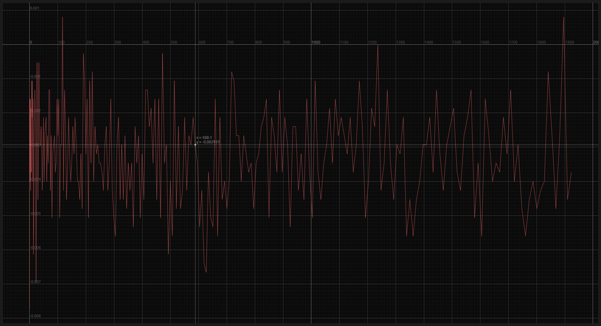
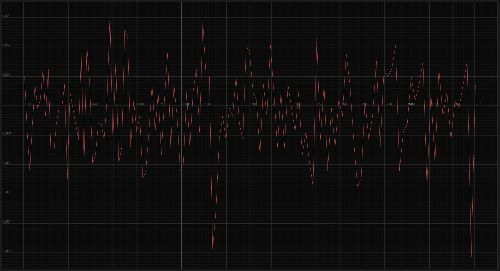
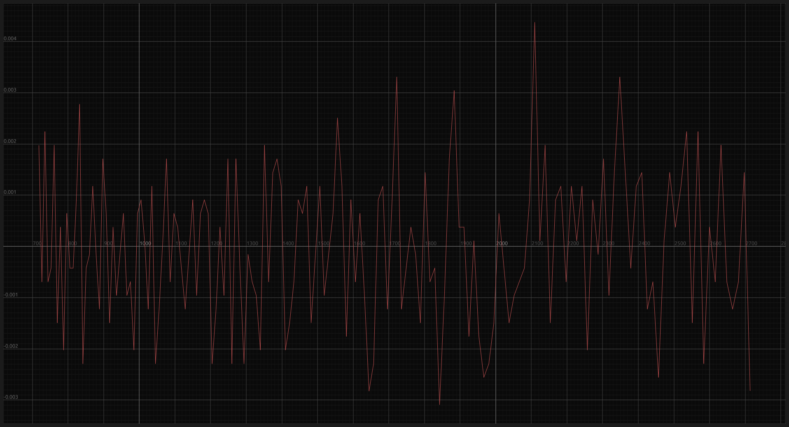
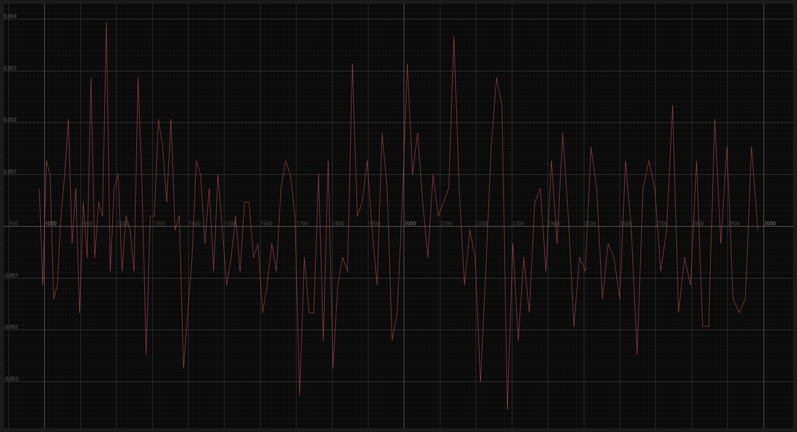

# Modulo per il controllo del giroscopio

## Setup del sensore

Per avviare il processo di sviluppo del modulo volto alla gestione del giroscopio, il primo passo da affrontare è il seguente:

Inizialmente, si procede con la creazione dell'istanza dell'oggetto `Mpu6050`. A tal fine, si fornisce il driver _I2C_ come argomento a questa istanza.

Subito dopo, occorre dare il via all'inizializzazione dell'oggetto e alla sua successiva configurazione. Questo procedimento implica:

- la disattivazione del sensore di temperatura, poiché non ritenuto necessario per l'obiettivo attuale;
- l'impostazione della sensibilità del giroscopio a ±500 °/s, al fine di adattarla alle specifiche esigenze dell'applicazione;

È opportuno sottolineare che, in questo contesto, la libreria utilizzata non consente all'utente di effettuare personalizzazioni relative al filtro passa-basso (DLPF), limitando quindi questa possibilità.

```rust
fn setup_mpu<D: DelayMs<u8>>(
    delay: &mut D,
    i2c: I2cDriver<'static>,
) -> Mpu6050<I2cDriver<'static>> {
    let mut mpu = Mpu6050::new(i2c);
    mpu.init(delay).unwrap();

    mpu.set_temp_enabled(false).unwrap();
    mpu.set_gyro_range(mpu6050::device::GyroRange::D500)
        .unwrap();

    mpu
}
```

Nello snippet non è presente la gestione degli errori.

## Calibrazione



Nell'illustrazione soprastante è evidente come i dati acquisiti dal sensore in uno stato statico manifestino un'oscillazione leggermente sotto lo zero, situandosi nell'intervallo compreso tra $0.001$ e $-0.008$.

Al fine di minimizzare il discostamento delle misurazioni effettuate dal sensore in stato di inattività rispetto allo zero, è stata adottata un'approccio di calibrazione basilare. Il procedimento adottato è il seguente: eseguo una misurazione, attendo per un millisecondo e successivamente calcolo la media delle letture raccolte nel corso di diverse iterazioni. Una volta completata la fase di calcolo, provvedo a spegnere il LED di controllo e restituisco i valori ottenuti dal processo di calibrazione.

### Test di calibrazione

Nel corso dei test di calibrazione svolti, è stato adottato un approccio che coinvolgeva tre set distinti di misurazioni: 500, 1000 e 2000. L'analisi delle rispettive letture in tutti e tre i test dimostra che queste presentano fluttuazioni tanto al di sopra quanto al di sotto dello zero. In contrasto, non si osserva un incremento sostanziale nell'abbattimento dell'intervallo di errore, che rimane approssimativamente compreso tra $0.003$ e $-0.004$.

- 500 misurazioni:
  
- 1000 misurazioni:
  
- 2000 misurazioni:
  

È pertinente osservare che il processo di calibrazione richiede un certo lasso di tempo, poiché ogni misurazione comporta un ritardo di $1ms$. Sebbene in teoria sarebbe necessario attendere $0.5s$ per il test con 500 misurazioni, $1s$ per quello con 1000 e $2s$ per quello con 2000, in pratica si verifica un rallentamento a causa delle operazioni matematiche coinvolte. Di conseguenza, il tempo effettivo si attesta a circa $1s$ per 500 misurazioni, circa $2s$ per 1000 e circa $4s$ per 2000.

Dal momento che l'incremento delle misurazioni non conduce a un vantaggio considerevole, ho deciso di adottare un set di 500 misurazioni per la calibrazione.

```rust
fn calibrate_gyro<D: DelayMs<u16>>(
    delay: &mut D,
    mpu: &mut Mpu6050<I2cDriver>,
    info_led: &mut PinDriver<Gpio6, Output>,
) -> (f32, f32, f32) {
    let (mut cal_r, mut cal_p, mut cal_y) = (0., 0., 0.);
    const NUMBER_CAL: usize = 500;

    for _ in 0..NUMBER_CAL {
        cal_r += mpu.get_gyro().unwrap().x;
        cal_p += mpu.get_gyro().unwrap().y;
        cal_y += mpu.get_gyro().unwrap().z;
        delay.delay_ms(1);
    }

    info_led.set_low().unwrap();

    (
        cal_r / NUMBER_CAL as f32,
        cal_p / NUMBER_CAL as f32,
        cal_y / NUMBER_CAL as f32,
    )
}
```

Nello snippet non è presente la gestione degli errori.
